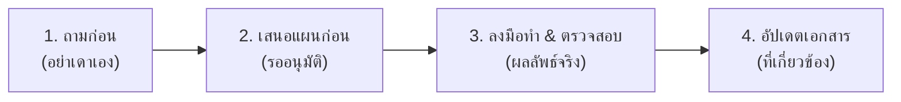

# AGENTS.md - กฎเหล็กและข้อกำหนดสำหรับ AI Agent ในโปรเจกต์ Tabian

เอกสารนี้เป็นข้อกำหนดบังคับสูงสุดสำหรับ AI Agent และผู้พัฒนาทุกคนที่ทำงานในโค้ดเบสนี้

---

## ⚠️ กฎเหล็กประจำโครงการ (Mandatory Golden Rules)

ทุกครั้งที่รับคำสั่งหรือจะลงมือดำเนินการใด ๆ ในโปรเจกต์นี้ ต้องปฏิบัติตามวงจร 4 ขั้นตอนนี้อย่างเคร่งครัด:

### 1. จะแก้อะไร สงสัยอะไร ให้ถามก่อน อย่าเดาเอง (Ask, Never Guess)
- ห้ามทึกทักเอาเองเด็ดขาดเมื่อพบความไม่ชัดเจนในความต้องการ
- หากมีตัวเลือกทางสถาปัตยกรรม เทคโนโลยี หรือการเปลี่ยนแปลงใด ๆ ต้องถามและขอความเห็นชอบจากผู้ใช้ก่อนเสมอ

### 2. เสนอแผนก่อน (Propose Plan First)
- ก่อนเขียนหรือแก้ไขโค้ด ต้องนำเสนอแผนงาน (Step-by-Step Implementation Plan) ให้ผู้ใช้เห็นภาพรวมและอนุมัติก่อน

### 3. ทำแล้วต้องตรวจสอบได้ผลลัพธ์จริง ๆ (Verify with Tangible Results)
- หลังจากเขียนหรือแก้ไขโค้ดแล้ว ต้องสั่งรันคำสั่ง รันเทสต์ หรือทดสอบจริงผ่าน Terminal
- ต้องแสดงหลักฐานและผลลัพธ์จริงว่าระบบทำงานได้ถูกต้อง ไม่ใช่เพียงบอกว่าเสร็จแล้ว

### 4. อัปเดตเอกสารที่เกี่ยวข้องเสมอ (Keep Documentation in Sync)
- เมื่อมีการสร้าง API ใหม่ เปลี่ยนสกีมาฐานข้อมูล หรือปรับปรุงฟังก์ชัน ต้องเปิดและอัปเดตไฟล์เอกสารที่เกี่ยวข้องทันที:
  - สถาปัตยกรรม -> `ARCHITECTURE.md`
  - ตารางฐานข้อมูล -> `DATABASE.md`
  - ฟังก์ชันระบบ -> `FEATURES.md`
  - API Endpoints -> `API.md`
  - การตัดสินใจ -> `DECISIONS.md`
  - ตัวแปรระบบ -> `ENVIRONMENT.md`

---

## 📌 สรุปข้อมูลโปรเจกต์ (Project Quick Reference)
- **ชื่อโปรเจกต์**: Tabian (ระบบจัดการทะเบียนรถสูญหายช่วงน้ำท่วม)
- **Tech Stack**: Nuxt 3 (Vue 3) + Nitro + Tailwind CSS + SQLite (WAL Mode) / Prisma ORM
- **AI Model**: Google Gemini 2.0/1.5 Flash (Multimodal Vision API & Structured Text Parsing)
- **เอกสารโครงการทั้งหมด**: อยู่ที่ Root ไดเรกทอรี
