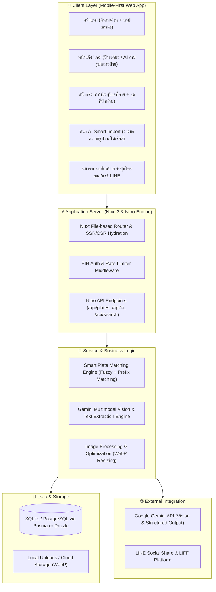
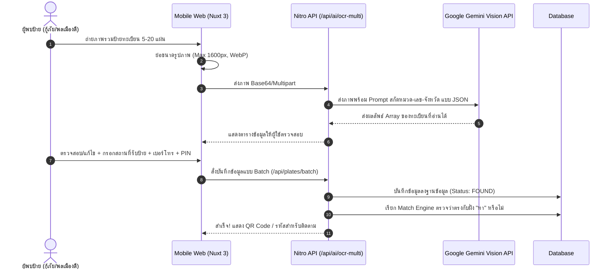
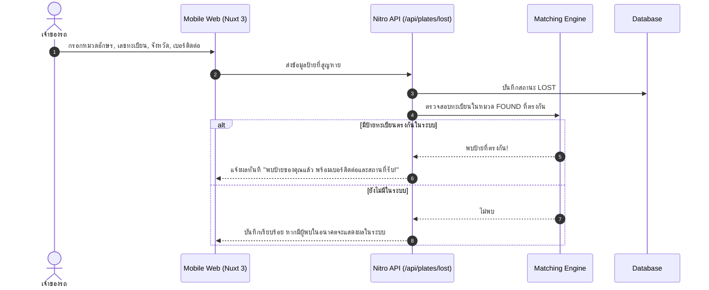

# ARCHITECTURE.md - สถาปัตยกรรมระบบ Tabian (ระบบจัดการทะเบียนรถสูญหายช่วงน้ำท่วม)

## 1. ภาพรวมระบบ (System Overview)
Tabian คือเว็บแอปพลิเคชัน Mobile-First ออกแบบมาเพื่อรับมือสถานการณ์ฉุกเฉินน้ำท่วม สำหรับจับคู่และส่งคืนแผ่นป้ายทะเบียนรถยนต์และรถจักรยานยนต์ที่หลุดหายจากการลุยน้ำท่วม โดยเน้นความง่ายในการใช้งานบนโทรศัพท์มือถือ ความเร็วในการค้นหา และความสามารถในการดึงข้อมูลทะเบียนหลายแผ่นพร้อมกันจากภาพถ่ายหรือโพสต์โซเชียลมีเดียด้วย AI

---

## 2. แผนภาพสถาปัตยกรรมระดับสูง (High-Level Architecture)

---

## 3. องค์ประกอบทางเทคนิค (Technical Stack)

| ส่วนประกอบ | เทคโนโลยี | เหตุผลและหน้าที่ |
|---|---|---|
| **Core Framework** | **Nuxt 3 (Vue 3)** | ประสิทธิภาพสูง โหลดเร็วบนมือถือ รองรับ SSR สำหรับ SEO และ CSR เพื่อความลื่นไหล |
| **Server Engine** | **Nitro (Nuxt Built-in Engine)** | รัน API Serverless หรือ Node.js Server ได้อย่างเบาและรวดเร็ว |
| **Styling & Design** | **Tailwind CSS + Tailwind Aspect Ratio** | ออกแบบ UI Mobile-First ระบบ Responsive UI และรองรับ Touch Targets ขนาดใหญ่ |
| **Icons** | **Lucide Vue Next** | ไอคอน Vector ชัดเจน โหลดเฉพาะที่ใช้งาน |
| **Database ORM** | **Prisma ORM (with LibSQL Adapter)** | Type-safe Database Access รองรับ Dual-Engine: Local SQLite (เครื่อง/Render) และ Turso Cloud SQLite (สำหรับ Vercel Serverless) |
| **AI Vision & NLP** | **Google Gemini 2.5 Flash API** | แม่นยำสูงกับฟอนต์ภาษาไทย ป้ายเปื้อนโคลน และรองรับ Structured JSON Output |
| **Image Processing** | **Sharp (Server) + Canvas (Client-side Resize)** | บีบอัดรูปภาพเป็น WebP ก่อนส่งขึ้นเซิร์ฟเวอร์ ประหยัดเน็ตมือถือ |
| **Social Sharing** | **LINE URL Scheme & Open Graph Protocol** | แผงพรีวิวสวยงามเมื่อแชร์ป้ายที่เจอลง LINE กลุ่มหรือ Facebook |

---

## 4. แผนผังการไหลของข้อมูล (Data Flow Diagrams)

### 4.1 ขั้นตอนการลงข้อมูลฝั่ง "เจอ" ผ่าน AI Multi-Plate OCR

### 4.2 ขั้นตอนการลงข้อมูลฝั่ง "หา" และการจับคู่ (Smart Matching)

---

## 5. การรักษาความปลอดภัยและความเป็นส่วนตัว (Security & Privacy)
1. **Masked Phone Numbers**: หน้าเว็บสาธารณะจะแสดงเบอร์โทรในรูปแบบ `081-xxx-1234` มีปุ่ม "กดเพื่อโทรออก" เพื่อป้องกัน Web Scraping บอทดูดเบอร์โทรศัพท์
2. **PIN-Protected Operations**: เมื่อสร้างรายการ จะให้ผู้ใช้กำหนด PIN 4 หลัก โดยระบบจะ Hash ด้วย bcrypt/Argon2 เพื่อใช้ยืนยันเวลาต้องการแก้ไขหรือกดปิดสถานะ "รับคืนเรียบร้อยแล้ว"
3. **Rate Limiting**: จำกัดจำนวนครั้งในการเรียก API (เช่น การใช้ AI OCR และการบันทึก) ผ่าน IP-based Rate Limiter ป้องกันการยิงสแปม
4. **Input Sanitization**: ตรวจสอบและ Escape ข้อมูลตัวอักษรเพื่อป้องกัน XSS และ SQL Injection
