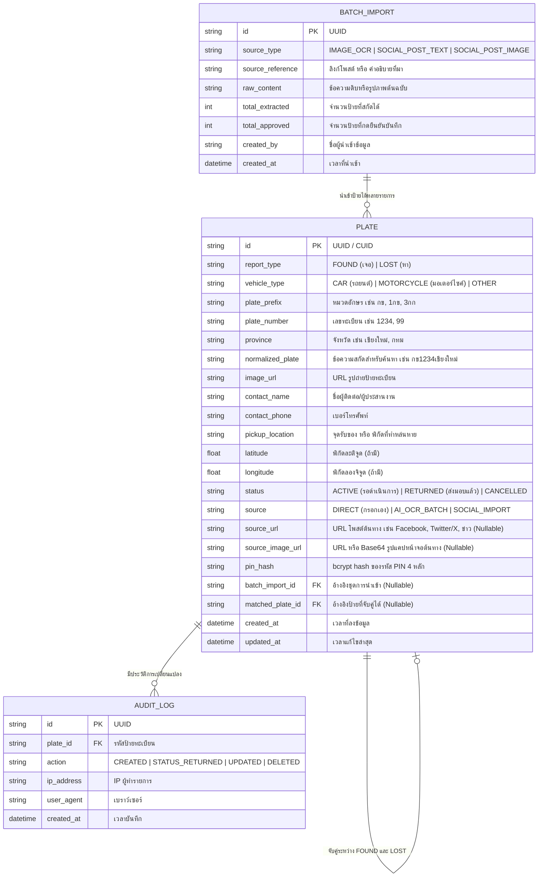

# DATABASE.md - โครงสร้างฐานข้อมูลระบบ Tabian

## 1. ภาพรวมการออกแบบฐานข้อมูล (Database Overview)
ระบบฐานข้อมูลของ Tabian ได้รับการออกแบบให้รองรับทั้ง **SQLite** (สำหรับใช้งานในสภาพแวดล้อมฉุกเฉิน ติดตั้งได้ง่าย ไม่มี Overhead) และสามารถขยายสู่ **PostgreSQL** ได้ทันทีโดยใช้ **Prisma ORM**

จุดสำคัญที่สุดของฐานข้อมูลนี้คือ **ความเร็วในการค้นหาหมายเลขทะเบียน** โดยมีการทำ `normalized_plate` และ Multi-Column Index เพื่อให้ค้นหาได้ไวแม้มีข้อมูลหลายหมื่นรายการ

---

## 2. แผนผังความสัมพันธ์ (Entity-Relationship Diagram)

---

## 3. รายละเอียดโครงสร้างตาราง (Table Specifications)

### 3.1 ตาราง `Plate` (ข้อมูลแผ่นป้ายทะเบียน)
| ฟิลด์ | ชนิดข้อมูล | เงื่อนไข | คำอธิบาย |
|---|---|---|---|
| `id` | `String` | PK, Cuid/UUID | รหัสประจำรายการ |
| `reportType` | `Enum/String` | NOT NULL | `FOUND` (เจอ) หรือ `LOST` (ตามหา) |
| `vehicleType` | `Enum/String` | NOT NULL, Default `CAR` | `CAR` (รถยนต์), `MOTORCYCLE` (มอเตอร์ไซค์) |
| `platePrefix` | `String` | NOT NULL | หมวดอักษร เช่น "กข", "1กข" |
| `plateNumber` | `String` | NOT NULL | หมายเลข เช่น "1234", "9" |
| `province` | `String` | NOT NULL | จังหวัด เช่น "เชียงใหม่" |
| `normalizedPlate`| `String` | NOT NULL, INDEX | ข้อความรวมตัดเว้นวรรค เช่น "กข1234เชียงใหม่" |
| `imageUrl` | `String` | NULLABLE | ลิงก์รูปถ่ายป้าย |
| `contactName` | `String` | NOT NULL | ชื่อผู้ประสานงาน / จุดรับ |
| `contactPhone` | `String` | NOT NULL | เบอร์โทรศัพท์ |
| `pickupLocation`| `String` | NOT NULL | สถานที่รับป้าย หรือ สถานที่น้ำท่วมที่ทำหล่น |
| `latitude` | `Float` | NULLABLE | ละติจูดของสถานที่ |
| `longitude` | `Float` | NULLABLE | ลองจิจูดของสถานที่ |
| `status` | `Enum/String` | NOT NULL, Default `ACTIVE` | `ACTIVE` (รอรับ/ตามหา), `RETURNED` (คืนแล้ว), `CANCELLED` |
| `source` | `String` | NOT NULL, Default `DIRECT` | `DIRECT`, `AI_OCR_BATCH`, `SOCIAL_IMPORT` |
| `sourceUrl` | `String` | NULLABLE | ลิงก์โพสต์ต้นทาง (เช่น Facebook, X, ข่าว) |
| `sourceImageUrl` | `String` | NULLABLE | รูปแคปหน้าจอโพสต์/แชทต้นทาง |
| `pinHash` | `String` | NOT NULL | รหัส PIN 4 หลัก เข้ารหัสผ่าน bcrypt/hash |
| `batchImportId`| `String` | NULLABLE, FK | อ้างอิงตาราง BatchImport |
| `matchedPlateId`| `String`| NULLABLE, FK | อ้างอิงป้ายคู่กรณี (เช่น เจอจับคู่กับหา) |
| `createdAt` | `DateTime` | NOT NULL, Default NOW | วันที่เวลาสร้าง |
| `updatedAt` | `DateTime` | NOT NULL, OnUpdate NOW | วันที่เวลาแก้ไข |

---

### 3.2 ตาราง `BatchImport` (ชุดการนำเข้าข้อมูลผ่าน AI)
| ฟิลด์ | ชนิดข้อมูล | เงื่อนไข | คำอธิบาย |
|---|---|---|---|
| `id` | `String` | PK | รหัสการนำเข้า |
| `sourceType` | `String` | NOT NULL | `IMAGE_OCR` หรือ `SOCIAL_TEXT` |
| `sourceReference` | `String` | NULLABLE | ลิงก์โพสต์เฟซบุ๊ก หรือ กลุ่มกู้ภัย |
| `rawContent` | `Text` | NULLABLE | ข้อความต้นฉบับที่นำมาวาง |
| `totalExtracted` | `Int` | NOT NULL | จำนวนป้ายที่ AI อ่านได้ |
| `totalApproved` | `Int` | NOT NULL | จำนวนป้ายที่ผู้ใช้ตรวจสอบแล้วกดบันทึก |
| `createdAt` | `DateTime` | NOT NULL, Default NOW | วันที่นำเข้า |

---

### 3.3 ตาราง `AuditLog` (บันทึกประวัติละเอียด: IP, Browser, OS, Device, Location)
| ฟิลด์ | ชนิดข้อมูล | เงื่อนไข | คำอธิบาย |
|---|---|---|---|
| `id` | `String` | PK | รหัสบันทึก (CUID) |
| `plateId` | `String` | NOT NULL, FK | รหัสป้ายทะเบียนที่ทำรายการ |
| `action` | `String` | NOT NULL | `CREATED`, `BATCH_CREATED`, `STATUS_RETURNED`, `PIN_UPDATED`, `ADMIN_UPDATED`, `DELETED` |
| `ipAddress` | `String` | NULLABLE | Client IP จริง (ดึงจาก X-Forwarded-For, X-Real-IP, Cloudflare, Vercel) |
| `userAgent` | `String` | NULLABLE | User-Agent Header แบบเต็ม |
| `deviceType` | `String` | NULLABLE | ประเภทอุปกรณ์ (`MOBILE`, `TABLET`, `DESKTOP`, `UNKNOWN`) |
| `browser` | `String` | NULLABLE | ชื่อเบราว์เซอร์ (เช่น Google Chrome, Safari, LINE In-App, Facebook In-App) |
| `os` | `String` | NULLABLE | ระบบปฏิบัติการ (เช่น iOS 17.4, Android 14, Windows 10/11, macOS) |
| `city` | `String` | NULLABLE | เมือง/จังหวัด จาก Geo-IP (Vercel / Cloudflare) |
| `country` | `String` | NULLABLE | ประเทศ (เช่น `TH`) |
| `latitude` | `Float` | NULLABLE | ละติจูด (จาก GPS มือถือ หรือ Geo-IP) |
| `longitude` | `Float` | NULLABLE | ลองจิจูด (จาก GPS มือถือ หรือ Geo-IP) |
| `metadata` | `Text/JSON` | NULLABLE | JSON รายละเอียดดิบทั้งหมด (Screen, Languages, Timezone, Full Headers) |
| `createdAt` | `DateTime` | NOT NULL, Default NOW | วันที่และเวลาที่ทำรายการ |

---

## 4. กลยุทธ์การทำดัชนี (Indexing Strategy)
เพื่อประสิทธิภาพสูงสุดในการค้นหาบนสมาร์ทโฟน:
1. `CREATE INDEX idx_plate_normalized ON Plate(normalizedPlate);` -> ใช้สำหรับการค้นหาแบบ Exact และ Prefix
2. `CREATE INDEX idx_plate_search ON Plate(plateNumber, province, vehicleType);` -> ค้นหาแยกตามเลขทะเบียนและจังหวัด
3. `CREATE INDEX idx_plate_status_type ON Plate(reportType, status, createdAt DESC);` -> ฟิลเตอร์หน้าแรก (รายการที่ยังรอเจ้าของ)
