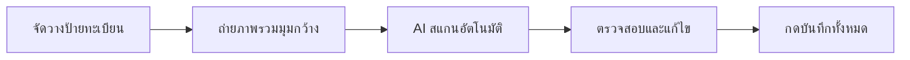

# IMPORT_GUIDE.md - คู่มือการนำเข้าข้อมูลหลายรายการ (Batch & Social Import)

คู่มือนี้จัดทำขึ้นสำหรับเจ้าหน้าที่กู้ภัย จิตอาสา และแอดมินกลุ่มช่วยเหลือภัยพิบัติ เพื่อให้สามารถนำเข้าข้อมูลป้ายทะเบียนจำนวนมากเข้าสู่ระบบได้อย่างรวดเร็ว

---

## 1. วิธีที่ 1: การนำเข้าด้วยภาพถ่ายกองป้ายทะเบียน (Multi-Plate Photo OCR)

เหมาะสำหรับกรณี: **กู้ภัยรวบรวมแผ่นป้ายทะเบียนมาไว้ที่เต็นท์หรือป้อมได้ 5 - 30 แผ่น**



### คำแนะนำในการถ่ายภาพเพื่อให้ AI อ่านได้แม่นยำ 100%:
1. **การจัดวาง**: วางแผ่นป้ายเรียงกันบนพื้นหรือโต๊ะ อย่าให้ซ้อนทับบังตัวเลข
2. **แสงสว่าง**: ถ่ายในที่สว่าง หลีกเลี่ยงแสงสะท้อนจ้าบนแผ่นป้ายอะลูมิเนียม
3. **คราบโคลน**: หากมีโคลนเกาะหนามาก ให้ใช้ผ้าหรือน้ำลูบเปิดให้เห็นตัวเลขและชื่อจังหวัด
4. **ความละเอียด**: ถ่ายด้วยโหมดปกติของมือถือ ไม่จำเป็นต้องซูม ให้เห็นป้ายครบทุกแผ่น

### ขั้นตอนในระบบ:
1. เข้าเมนู **"เจอ (พบป้ายทะเบียน)"** -> เลือกแท็บ **"ถ่ายรูปรวมหลายป้าย (AI)"**
2. เลือกภาพถ่ายจากคลังภาพ หรือกดถ่ายด้วยกล้อง
3. ระบบจะส่งภาพให้ **Gemini Vision AI** วิเคราะห์ภายใน 2-4 วินาที
4. ผลลัพธ์จะแสดงเป็นตารางรายการ:
   - ตรวจดูหมวดอักษร, หมายเลข, จังหวัด
   - สามารถแตะเพื่อพิมพ์แก้ไขตัวอักษรได้ทันที
   - หากมีป้ายไหนตกหล่น สามารถกด "เพิ่มแถว" กรอกเสริมได้
5. กรอก **"สถานที่รับป้ายร่วมกัน"** (เช่น ป้อมกู้ภัยแม่สาย) และ **"เบอร์โทรติดต่อ"** เพียงครั้งเดียว ระบบจะแนบไปกับทุกป้ายในชุดนั้น
6. ตั้งรหัส **PIN 4 หลัก** แล้วกด **"ยืนยันบันทึกข้อมูลทั้งหมด"**

---

## 2. วิธีที่ 2: การนำเข้าจากข้อความใน Social Media (Social Media Text Importer)

เหมาะสำหรับกรณี: **มีคนสรุปรายชื่อป้ายทะเบียนที่เก็บได้ในกลุ่ม Facebook หรือไลน์กลุ่ม**

### ตัวอย่างข้อความที่พบบ่อยในกลุ่มภัยพิบัติ:
```text
ประชาสัมพันธ์ครับ วันนี้กู้ภัยร่วมใจเก็บป้ายทะเบียนตกหล่นได้แถวสะพานป่าแดด
ใครเป็นเจ้าของติดต่อรับได้ที่ศูนย์ประสานงานกู้ภัย เบอร์ 081-999-8888
1. ฆผ 1234 กทม
2. กข 9081 เชียงใหม่
3. มอไซค์ 1กข 777 เชียงใหม่
4. ขค 554 ลำพูน
```

### ขั้นตอนในระบบ:
1. กดปุ่ม **"นำเข้าจากโพสต์โซเชียล"**
2. คัดลอกข้อความทั้งหมดจาก Facebook / LINE มาวางลงในกล่องข้อความ
3. กดปุ่ม **"ให้ AI ช่วยสกัดข้อมูล"**
4. AI จะอ่านและแยกแยะให้อัตโนมัติ:
   - สกัด **เบอร์โทรศัพท์** (`081-999-8888`)
   - สกัด **สถานที่รับของ** (`ศูนย์ประสานงานกู้ภัย แถวสะพานป่าแดด`)
   - สกัด **รายการป้ายทะเบียน** ทั้ง 4 แผ่น พร้อมแยกหมวดและประเภทรถ
5. ผู้ใช้ตรวจสอบความถูกต้องในหน้า Preview แล้วกดยืนยันบันทึก

---

## 3. วิธีที่ 3: การนำเข้าจากภาพแคปหน้าจอโพสต์ (Social Screenshot)
- สามารถอัปโหลดภาพแคปหน้าจอโพสต์ Facebook ที่มีทั้งข้อความและรูปภาพป้ายทะเบียน
- Gemini Multimodal จะทำการอ่านทั้งข้อความและรูปภาพในแคปหน้าจอพร้อมกัน
