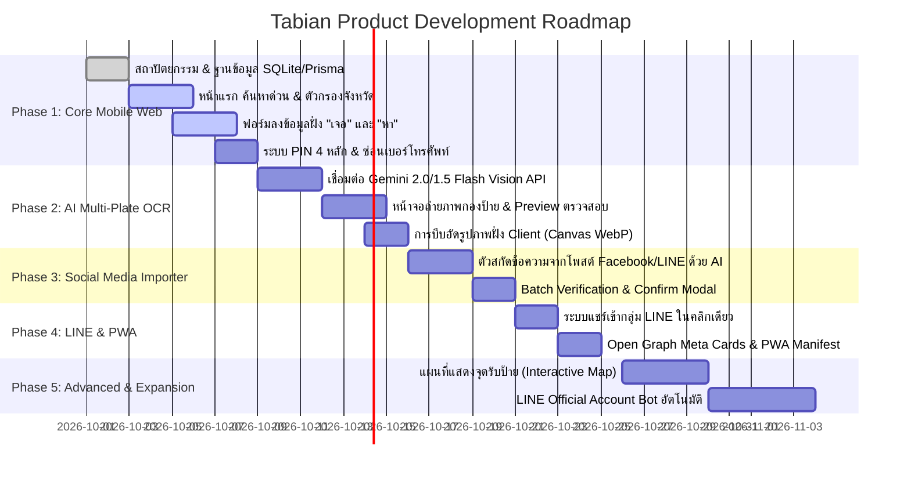

# ROADMAP.md - แผนงานการพัฒนาระบบ Tabian (Development Roadmap)

แผนงานการพัฒนาระบบ Tabian แบ่งออกเป็นระยะ (Phases) เพื่อให้สามารถเปิดใช้งานฟังก์ชันกู้ภัยจำเป็นได้อย่างรวดเร็วที่สุด แล้วค่อยทยอยเพิ่มฟีเจอร์ระดับสูง

---

---

## รายละเอียดแต่ละระยะ (Milestones)

### Phase 1: Core Disaster Response (สัปดาห์ที่ 1)
- [x] ออกแบบโครงสร้างระบบและเอกสารมาตรฐานโครงการ
- [x] ติดตั้ง Nuxt 3, Tailwind CSS, Prisma และ SQLite
- [x] พัฒนาหน้า Home สำหรับค้นหาเลขทะเบียนด่วน (Instant Search)
- [x] พัฒนาฟอร์มกรอกรายการเดี่ยวฝั่ง "เจอ" (พบป้าย) และฝั่ง "หา" (ป้ายหาย)
- [x] ระบบสร้างและตรวจสอบ PIN 4 หลัก สำหรับอัปเดตสถานะ "รับคืนแล้ว"

### Phase 2: AI Multi-Plate OCR (สัปดาห์ที่ 2)
- [x] พัฒนา Endpoint `/api/ai/ocr-multi` เชื่อมต่อ Gemini Vision API
- [x] พัฒนาหน้าจอรองรับการถ่ายภาพกองป้ายทะเบียน (5 - 30 ป้ายต่อรูป)
- [x] หน้าจอ Review Table ให้กู้ภัยตรวจสอบ/แก้ไขเลขทะเบียนก่อนบันทึก
- [x] Client-side Image Resizing เพื่อให้ส่งรูปผ่านเน็ตมือถือได้รวดเร็ว

### Phase 3: Social Media Importer (สัปดาห์ที่ 3)
- [x] พัฒนาระบบ AI Smart Paste สำหรับข้อความโพสต์จากกลุ่ม Facebook/LINE
- [x] ระบบสกัดเบอร์โทร, สถานที่รับป้าย และรายการป้ายทะเบียนอัตโนมัติ
- [x] ระบบบันทึกแบบกลุ่ม (Batch Save `/api/plates/batch`)

### Phase 4: LINE Integration & PWA (สัปดาห์ที่ 4)
- [x] ปุ่ม 1-Click Share to LINE Chat / Group พร้อมพรีวิวข้อความ
- [x] Dynamic Open Graph Meta Tags สำหรับพรีวิวในแชท LINE
- [ ] ตั้งค่า PWA (Add to Home Screen) ติดตั้งเป็นไอคอนบนหน้าจอมือถือได้

### Phase 5: แผนที่และการขยายผล (Future Enhancements)
- [ ] แสดงจุดรับป้ายทะเบียนบนแผนที่ (Leaflet / Google Maps)
- [ ] บอท LINE Official Account รับรูปป้ายและบันทึกอัตโนมัติผ่าน Webhook
